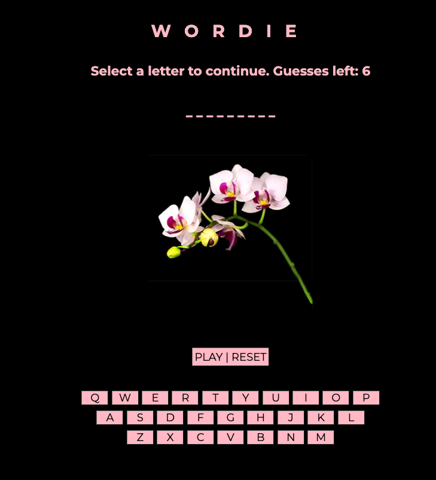
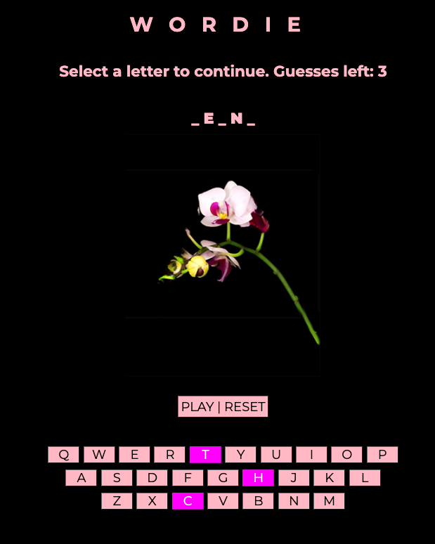
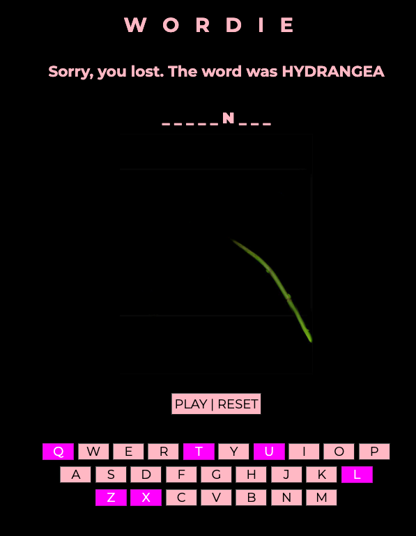

# Wordie - A Word Guessing Game

## About

Wordie is a visually appealing word guessing game where players try to guess the secret word related to flower names within a limited number of guesses. This JavaScript-based game challenges your knowledge of flowers and your ability to solve unknown words through strategic guessing.

## Features

- **Vibrant Visual Feedback**: Utilizes a series of flower images to visually represent the player's progress and the number of guesses remaining.
- **Dynamic Guessing Interface**: Offers an interactive button-based interface for letter selection.
- **Engaging Success and Failure States**: Celebrates victories with a victory video and visually indicates game over state for losses.
- **Adaptive Difficulty**: The secret word is randomly selected from a predefined list of flower names, ensuring a fresh challenge with each game.

## How to Play

1. **Start the Game**: Simply load the game in your browser by clicking this [link](https://josegalvez-h.github.io/wordieProject1/) and press the "Start" button to begin.
2. **Guess the Word**: Click on the letters you think are in the secret word. The game will indicate correct and incorrect guesses.
3. **Winning and Losing**: You must guess the word within six attempts to win. The game ends when you guess the word correctly or exhaust your guesses.

## Code Highlights

- **Dynamic Content Creation**: Elements like images and videos are dynamically created and manipulated in the DOM based on the game's progress, enhancing the interactive experience.
- **Efficient State Management**: The game's state is managed through a series of variables that track the current secret word, the player's answer so far, wrong guesses, and the game's status.
- **Preloading of Assets**: The `preloadImages()` function improves the game's performance by loading all image assets in advance.
- **Modular Function Design**: The game logic is organized into well-defined functions, such as `init()` for game initialization, `handleBtnClick()` for processing letter guesses, and `render()` for updating the UI based on the game state.

## Game UI and Screenshots

Wordie offers an intuitive and user-friendly interface, designed to enhance your gaming experience. Below are some highlights of the game's UI components and a peak into the gameplay through screenshots.

### Game Interface
The game interface displays the secret word as underscores for letters that need to be guessed and reveals letters as they are correctly guessed. Below the secret word and orchid image, you'll find an interactive keyboard where you can select letters to guess the secret word.

### Visual Feedback for Guesses
Each guess updates the visual feedback component, which includes images representing the number of guesses left and changes depending on the correctness of your guess.

### Winning Screen
Upon guessing the word correctly, the victory screen appears, celebrating your win. This screen will play a victory video, of an orchid blooming, making your win even more rewarding.

### Game Over Screen
If you're unable to guess the word within the allowed 6 attempts, the game over screen provides feedback on the correct word. Along with an empty orchid stem.

## Setup

1. Clone the repository to your local machine.
2. Open the project's root directory in your browser.
3. Enjoy the game!

## Contributions

I welcome contributions and suggestions to make Wordie even better. Feel free to fork the repository.

